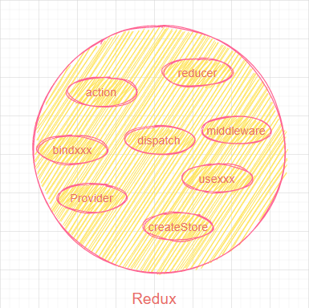
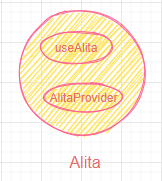
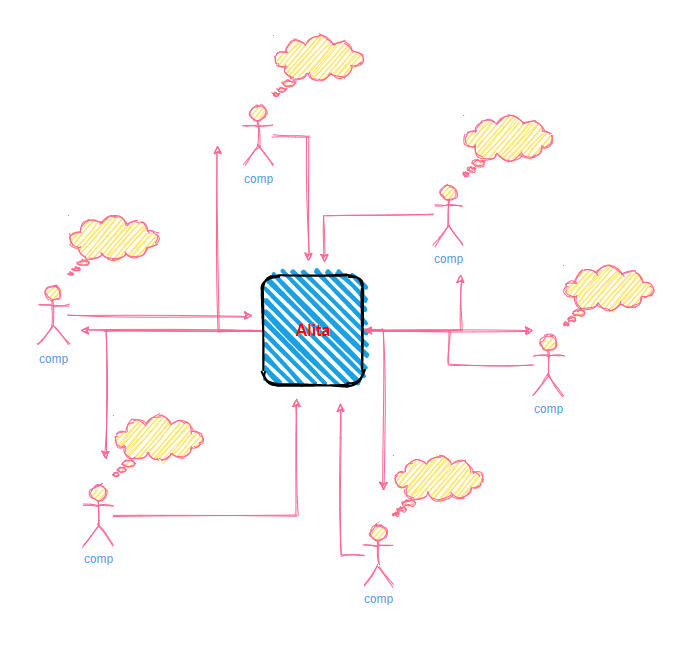

## 什么是redux-alita?

redux-alita是一个封装了react + redux 操作的极简的工具插件，你可以用它来提升日常的开发效率。

为什么叫alita？卡导的《Alita》得名。本插件和她的特点一样，精致，迅捷，简单，（开发）速度快。

## 为什么会存在redux-alita?

### 一般的redux的使用是怎么样的？



action是什么？reducer是什么？dispatch又是什么？等等。。。


### redux-alita的使用是怎么样的？



OK,现在你只需要记住useAlita和AlitaProvider即可。


## 快速达到目的

我在项目中想达到的目的是什么？是能够简单的操作state数据，而这个state数据能够在所有的组件之间传递。用了alita，你不需要关心action是什么，reducer是什么，怎么样去触发action，还有异步数据怎么操作等等。

你只需要知道，我有这么一个工具，和普通setState用法一致的工具，我用这个工具创建的state，可以在容器下面的任何组件之前传递。

组件之间的通信交流：



## 如何使用？

> 重点关注hooks的用法

- 安装redux-alita: yarn add redux-alita 或者 npm i redux-alita
- 引入AlitaProvider包裹根组件
```js
import { AlitaProvider } from 'redux-alita';

<AlitaProvider>
    <App />
</AlitaProvider>
```
- 函数组件中使用
```js
import { useAlita } from 'redux-alita';
function App() {
    let [count = 0, setAlita] = useAlita('count', { light: true });
    return (
        <div>
            <a onClick={() => setAlita({ stateName: 'count', data: ++count })}>+</a>
             <a onClick={() => setAlita({ stateName: 'count', data: --count })}></a>
             <div>count:{count}</div>
        </div>
    )
}
```

## API
|API名称|描述|
|---|---|
|AlitaProvider|绑定redux到react(react-redux Provider的封装)
|useAlita|获取state和stateState的hook api，参数可以传多个，最后一个参数可以用来设置option（对象，{light: true}, light设置true表示直接获取state的值，不设置的话获取的值将被{isFetching: xxx, data: xxx}包裹）。其他都是state的相关参数，例如：useAlita('count', { name: 'yezihaohao' })，直接传字符串表示不设置默认值，获取到的值为undefined，传对象{key: value}，value为对应state的默认值。
|setAlita|useAlita返回的函数，设置alita state，用法见上面demo。参数形式1-一个参数：({ stateName: xxx, data: xxx });参数形式2-两个参数：(stateName, data);

## 在线demo

[在线示例，可尝试自己编辑](https://codesandbox.io/s/redux-alita-pmc0y?file=/src/index.tsx)

[实战示例-react-admin](https://github.com/react-better/react-admin)

## 结尾

未完待续~
